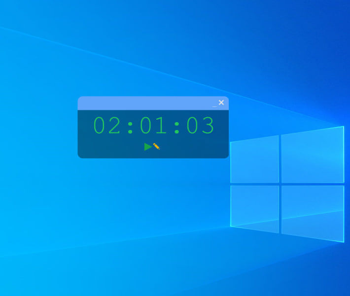
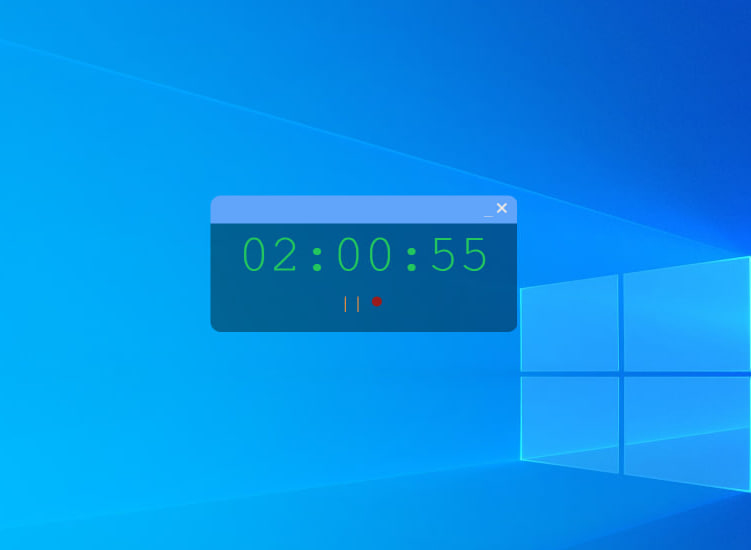
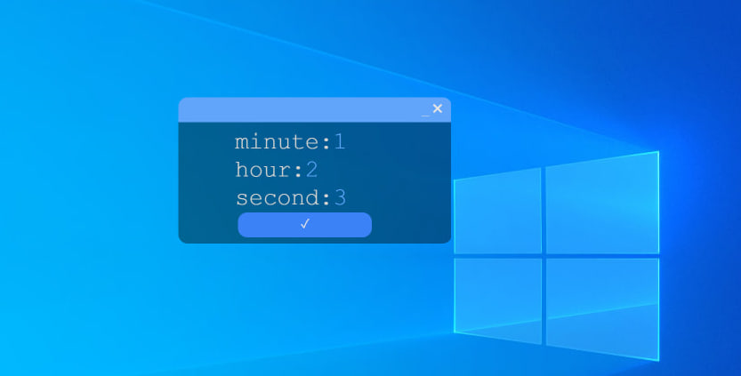

# Time Tracker Desktop App

This is a desktop application for tracking time, built using **Electron.js**, **Vite React**, and **Tailwind CSS**. The app provides a simple interface for setting a timer and tracking elapsed time efficiently.



---

## Features
- **Custom Time Input**: Allows users to set hours, minutes, and seconds for the timer.
- **Start/Pause Functionality**: Users can start, pause, and resume the timer as needed.
- **Minimal Design**: Built with a clean and modern interface using Tailwind CSS.


---

## Technologies Used
- **Electron.js**: To create a cross-platform desktop application.
- **Vite**: For a fast and efficient React development environment.
- **React**: To manage the user interface and state.
- **Tailwind CSS**: For a responsive and clean design.

---

## How to Run the App

### Prerequisites
1. Ensure **Node.js** and **npm** (or **yarn**) are installed.
2. Clone this repository:
   ```bash
   git clone https://github.com/your-username/time-tracker-desktop-app.git
   cd time-tracker-desktop-app
   ```

### Install Dependencies
Run the following command to install all necessary dependencies:
```bash
npm install
```

### Start the App in Development Mode
Launch the application in development mode with:
```bash
npm start
```

### Package the App
To create a production-ready build:
```bash
npm run build
```

---

## Usage
1. Launch the application.
2. Set the desired time in the input section.
3. Click the start button to begin tracking time.
4. Use the pause and resume buttons as needed.

---

## Contribution
Feel free to contribute to this project by:
- Reporting bugs.
- Suggesting new features.
- Submitting pull requests.

---

## Author
Ashenafi Dejene

---

## License
This project is licensed under the [MIT License](./LICENSE).

---

Replace `path-to-your-image.png` with the relative path of your app screenshot in your project folder. Let me know if you want additional customization!